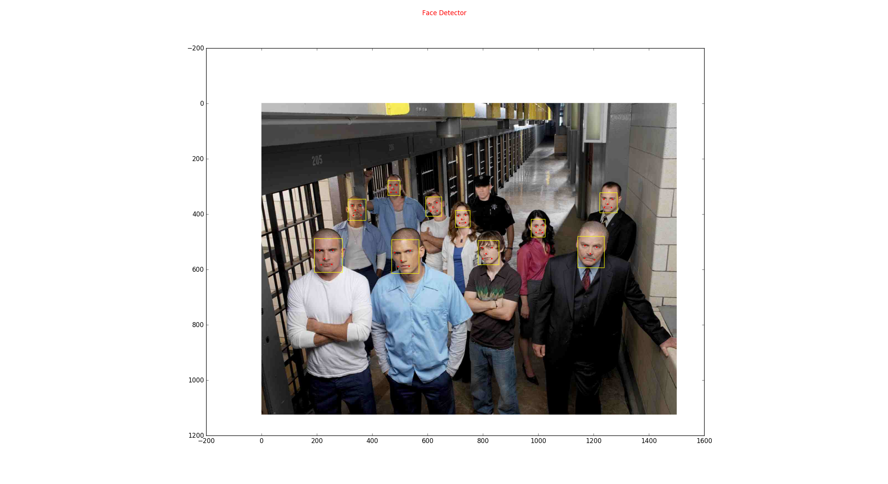

# MTCNN_TRAIN
MTCNN_Train Scripts with PyTorch 0.4.0  

## Declaration
**The source code in this repository is mainly from [kuaikuaikim/DFace](https://github.com/kuaikuaikim/DFace).** 
**I reimplemented the part of MTCNN with PyTorch 0.4.0 and made some optimizations but most remains unchanged. If you want to know more details, please go to [kuaikuaikim/DFace](https://github.com/kuaikuaikim/DFace)** 

---
## Introduction 

~~This project is still in progess, I will finish it in my spare time as soon as possible !~~  

This project is a reimplementation version of mtcnn face detection, most of the source code is from [kuaikuaikim/DFace](https://github.com/kuaikuaikim/DFace), I restructed the source code with Pytorch 0.4.0 and made some modifications and optimizations. All the contributions I have made is listed below.

## The Contributions
1. restruct the source code with PyTorch 0.4.0.
2. avoid some unnecessary image data copy operation in training data preparation, for example, ./prepare_data/gen_Pnet_data.py and so on.
3. remove some meaningless operation in traing process, and format the output information during training.
4. fix the bug that data_loader can't load the last mini_batch when the last minibatch'size is less than the batch_size in ./tools/image_reader.py. 
5. to be continue.  

## How to use  
For training PNet and RNet, I use the Widerface for face classification and face bounding box regression. For training ONet, I use Widerface for face classification and face bounding box regression and use [Training Dataset](http://mmlab.ie.cuhk.edu.hk/archive/CNN_FacePoint.htm) for face landmark regression.

1. Train PNet  
``` python  
cd MTCNN_TRAIN
python prepare_data/gen_Pnet_train_data.py
python prepare_data/assemble_pnet_imglist.py 
python train_net/train_p_net.py
```   
2. Train RNet 
``` python
cd MTCNN_TRAIN
python prepare_data/gen_Rnet_train_data.py
python prepare_data/assemble_rnet_imglist.py 
python train_net/train_r_net.py
```  
3. Train ONet   
``` python
cd MTCNN_TRAIN
python prepare_data/gen_landmark_48.py
python prepare_data/gen_Onet_train_data.py
python prepare_data/assemble_onet_imglist.py 
python train_net/train_o_net.py
```   
4. Test Image
``` python
cd MTCNN_TRAIN
python test_image.py
```

## Results  
Because I didn't use much data to train, the detection results is not at the best.  



